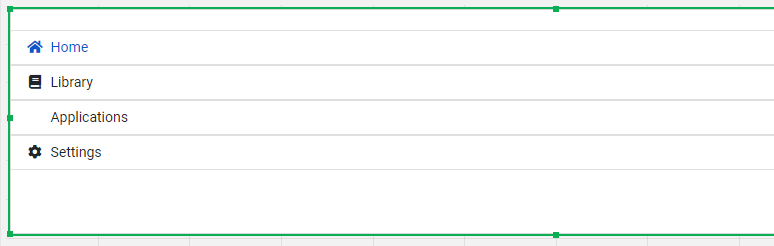

# HtmlFieldExtension for QlikSense
Object to draw html in QlikSense object. There several extensions like this, but some of them use Angular methods, some of them doesn't have bootstap styles and fontawesome. Additionally, when using Capability API some extensions have problems...

# How to install 
1. Zip and upload into QS distr folder OR just upload /output/HtmlFieldObject.zip

# How to change
1. npm install
2. bower install 
3. gulp //There will be created final distr folder and in folder ./output creates QS import ready zip file

